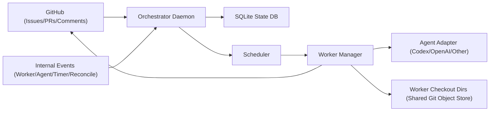

# MergeXO Design

## 1. Summary

MergeXO is a local-first Python service (managed with `uv`) that orchestrates AI agents to:

1. Turn GitHub issues into design-doc pull requests.
2. Run a human review loop on those PRs (comments -> agent responses/updates).
3. Promote merged, unimplemented design docs into implementation work.
4. Schedule up to `N` concurrent implementation agents.
5. Run the same PR review loop for implementation PRs until merge.

Primary runtime target: a home machine (for example, a Mac mini) with existing `gh` and Codex authentication.

GitHub is the primary external system of record for issues/PRs/comments, but orchestrator state transitions are driven by both GitHub events and internal runtime events (worker lifecycle, agent signals, timers, and reconciliation checks).

## 2. Goals

## 2.1 Functional goals

- Issue-driven design generation:
  - A GitHub issue becomes a design task.
  - An agent writes a design doc and opens a PR linked to the issue.
- PR feedback loop:
  - System watches PR comments/reviews.
  - Agent receives feedback and responds via comments and/or commits.
- Design-to-implementation promotion:
  - After design PR merge, unimplemented design docs become implementation candidates.
- Constrained implementation scheduling:
  - Run up to `N` workers concurrently.
  - Prefer high-priority work with low merge-conflict likelihood.
- Agent portability:
  - Codex first, but pluggable adapter model for multiple providers/agents.

## 2.2 Non-goals (initially)

- Perfect conflict prediction.
- Full autonomous merge without human review.
- Cross-repo dependency graph resolution across many organizations.

## 3. High-Level Architecture



## 3.1 Core components

1. `orchestrator`:
   - Long-running loop.
   - Deterministic Python control plane (no model-driven state transitions).
   - Consumes multiple event sources:
     - GitHub events (issues, PR comments, review comments, review state changes).
     - Worker lifecycle events (started/completed/failed/heartbeat timeout).
     - Agent action events (`mark_blocked`, `mark_failed`, `request_human_input`, etc.).
     - CI/check events and timer/retry/reconciliation events (poll ticks, lease expiry, PR head drift checks).
   - Is the only component that applies authoritative state transitions and dispatches work.
2. `state_store`:
   - SQLite database in WAL mode.
   - Persists work items, agent sessions, PR mappings, event cursors, and locks.
3. `worker_manager`:
   - Starts/stops workers for design and implementation tasks.
   - Manages a fixed pool of worker checkout directories (one directory per worker slot).
   - Uses shared git objects from a local bare mirror to reduce clone/fetch cost.
4. `scheduler`:
   - Selects implementation candidates subject to `N` concurrency.
   - Uses priority + conflict-risk score.
5. `github_gateway`:
   - Read/write API wrapper.
   - Uses `gh api` + `git` CLI (leveraging user’s existing `gh auth` login).
6. `agent_adapter`:
   - Standard interface for Codex and future providers.
   - Converts normalized task context + feedback into agent actions.
   - Does not call GitHub directly; all GitHub writes are executed by orchestrator via `github_gateway`.

## 3.2 Event model and authority

Event sources:

1. GitHub external events:
   - issue opened/labeled, PR comments/reviews, CI/check updates, merge/close.
2. Worker runtime events:
   - worker started, progress heartbeat, worker failed, worker completed.
3. Agent runtime events:
   - action batch emitted, blocked/failed signal, human-input request.
4. System events:
   - scheduler tick, retry backoff expiry, lease renewal/expiry, reconciliation tick.

Authority rules:

1. GitHub is the source of truth for issue/PR/comment/merge state.
2. SQLite is the source of truth for orchestrator runtime state (queues, sessions, leases, retries, dedupe cursors).
3. Only orchestrator mutates runtime state and performs GitHub writes.
4. Agents are decision engines that emit actions; they never directly mutate GitHub.

## 4. Repository and Runtime Layout

Suggested layout:

```text
mergexo/
  pyproject.toml
  README.md
  docs/
    design.md
  src/mergexo/
    cli.py
    config.py
    db.py
    orchestrator.py
    github_gateway.py
    scheduler.py
    models.py
    workers/
      design_worker.py
      implementation_worker.py
    agents/
      base.py
      codex_adapter.py
      openai_adapter.py
    prompts/
      design_prompt.md
      implementation_prompt.md
```

Runtime storage on machine:

- State DB: `~/.local/share/mergexo/state.db` (or configurable path).
- Bare mirrors (shared object store): `~/.local/share/mergexo/repos/<owner>/<repo>.git`.
- Worker checkouts (one real directory per worker slot): `~/.local/share/mergexo/checkouts/<owner>/<repo>/worker-<slot>/`.
- Logs: `~/.local/share/mergexo/logs/`.

## 4.1 Git checkout strategy (no worktrees)

1. Maintain one local bare mirror per tracked repo:
   - `git clone --mirror git@github.com:<owner>/<repo>.git ...` (first time).
   - `git fetch --prune` on each scheduler/orchestrator cycle.
2. Maintain `N` worker checkout directories per repo (or a global pool mapped to repo+slot).
3. Initialize each checkout by cloning with shared-object reference to the mirror.
4. Reuse the same checkout directory for new assignments in that slot:
   - fetch, hard-reset to target base branch, clean untracked files, checkout/create task branch.
5. All agent/file operations happen inside the worker checkout directory, not git worktrees.

## 5. Data Model (SQLite)

Key tables:

1. `repositories`
   - `id`, `owner`, `name`, `default_branch`, `active`.
2. `work_items`
   - `id`, `repo_id`, `kind` (`design` | `implementation`), `issue_number`,
     `design_doc_path`, `priority`, `status`, `parent_work_item_id`,
     `conflict_hint_paths` (json), `created_at`, `updated_at`.
3. `pull_requests`
   - `id`, `repo_id`, `github_pr_number`, `work_item_id`, `branch`,
     `head_sha`, `state`, `url`.
4. `agent_sessions`
   - `id`, `work_item_id`, `adapter`, `external_session_id`,
     `status`, `last_heartbeat_at`.
5. `github_events`
   - `id`, `repo_id`, `event_type`, `github_event_id`, `payload_json`,
     `seen_at`, `processed_at`.
6. `runtime_events`
   - `id`, `repo_id`, `work_item_id`, `event_type`, `payload_json`,
     `created_at`, `processed_at`.
7. `scheduler_leases`
   - `name`, `holder_id`, `expires_at` (for leader election / single scheduler).

Status enums:

- `work_items.status`:
  - `pending`, `running`, `awaiting_human`, `blocked`, `ready`, `merged`, `completed`, `failed`.

## 6. Workflows

## 6.1 Issue -> Design PR

1. Trigger:
   - New issue with opt-in label (for example: `agent:design`) or command comment.
2. Orchestrator creates `design` work item (`pending`).
3. Worker manager starts a Design Worker:
   - Assigns an available worker checkout slot and syncs it to the default branch.
   - Creates branch `agent/design/<issue>-<slug>`.
   - Invokes agent adapter with prompt and issue context.
4. Agent produces design doc at `docs/design/<issue>-<slug>.md`.
5. System commits/pushes and opens PR:
   - PR body references issue (`Refs #123`).
6. Work item enters `awaiting_human`.

## 6.2 Design PR review loop

1. Poller detects new review comments/comments.
2. Comments are deduplicated by GitHub comment/review event id.
3. Orchestrator routes feedback to the linked agent session.
4. Agent responds:
   - emits actions to orchestrator (comment reply, patch, commit/push).
   - orchestrator executes GitHub/git side effects via gateways and records resulting runtime events.
5. Loop repeats until PR merged or closed.
6. On merge:
   - Mark design work item `merged`.
   - Create implementation candidate (`ready`) if doc not yet implemented.

## 6.3 Implementation scheduling and execution

1. Scheduler scans `ready` implementation work items.
2. Computes score per candidate:

```text
score = (priority_weight * priority)
      - (conflict_weight * conflict_risk)
      - (staleness_penalty * days_waiting)
```

3. Picks up to `N - running_count` tasks greedily with low overlap.
4. Starts Implementation Workers on branches `agent/impl/<task>-<slug>`.
   - Each worker uses its assigned checkout directory/slot.
5. Worker opens implementation PR linking issue + design doc.
6. Same review loop applies.
7. On merge:
   - mark implementation work item `completed`.
   - retire agent session and clean/reset the worker checkout slot.

## 7. Conflict-Risk Heuristic

Initial (MVP) risk estimate:

1. Predict touched paths from design doc metadata/frontmatter.
2. Compare against changed files from active implementation PRs.
3. Add risk for same top-level module/service.
4. Add risk for very large tasks.

Example:

```text
conflict_risk =
  0.7 * jaccard(predicted_paths, active_pr_paths)
  0.2 * module_overlap
  0.1 * size_risk
```

Design docs should include structured metadata to improve scheduling, for example:

```yaml
---
issue: 123
priority: 4
touch_paths:
  - src/api/*
  - src/db/migrations/*
depends_on: []
estimated_size: M
---
```

## 8. Agent Integration Model

Use a normalized adapter interface:

```python
class AgentAdapter(Protocol):
    def start_task(self, task: TaskContext) -> AgentSession: ...
    def handle_feedback(self, session: AgentSession, feedback: FeedbackEvent) -> AgentActionBatch: ...
    def poll(self, session: AgentSession) -> AgentActionBatch: ...
    def stop(self, session: AgentSession) -> None: ...
```

`AgentActionBatch` supports:

- `post_github_comment`
- `apply_patch` (or write files)
- `commit_and_push`
- `request_human_input`
- `mark_blocked` / `mark_failed`

Execution contract:

1. Adapters emit normalized actions only.
2. Orchestrator validates, deduplicates, and executes actions.
3. Any action that touches GitHub (`post_github_comment`, PR updates) must flow through `github_gateway`.
4. Resulting side effects are written back as runtime events to keep recovery/idempotency deterministic.

Codex adapter approach:

- Start Codex session per work item with deterministic system prompt + task context.
- Feed review comments as incremental feedback events.
- Convert Codex outputs into normalized actions.

Future adapters (OpenAI direct API, other tools) implement the same interface.

## 8.1 Prompt pack and generation

Use small, phase-specific prompt templates instead of one monolithic prompt:

1. `system_base`: global behavior constraints and action protocol.
2. `design_start`: issue -> design doc kickoff.
3. `design_feedback`: process review/CI feedback on design PR.
4. `implementation_start`: merged design doc -> implementation kickoff.
5. `implementation_feedback`: process code review/CI feedback on implementation PR.
6. `state_summary`: compact rolling summary when context grows.

Example prompt generation (`design_start`):

```python
def build_design_start_prompt(ctx: TaskContext) -> str:
    return f"""
You are the Design Agent for repo {ctx.repo_full_name}.
Issue: #{ctx.issue_number} - {ctx.issue_title}

Goals:
- Produce design doc at {ctx.design_doc_path}
- Include frontmatter: issue, priority, touch_paths, depends_on, estimated_size
- Keep scope aligned to issue acceptance criteria

Constraints:
- Do not call GitHub directly.
- Emit normalized actions only.
- PR body must include: Refs #{ctx.issue_number}

Issue body:
{ctx.issue_body}
""".strip()
```

Example prompt generation (`implementation_start`):

```python
def build_implementation_start_prompt(ctx: ImplTaskContext) -> str:
    return f"""
You are the Implementation Agent for repo {ctx.repo_full_name}.
Implement the merged design document below.

Design doc path: {ctx.design_doc_path}
Design merge commit: {ctx.design_merge_sha}
Target base branch: {ctx.base_branch}@{ctx.base_sha}

Accepted decisions:
{ctx.accepted_decisions}

Out-of-scope constraints:
{ctx.non_goals}

Design document:
{ctx.design_doc_markdown}
""".strip()
```

## 8.2 Agent state across PR lifetime

Canonical state must live in ORCH + SQLite, not only in model conversation memory.

Persist per agent session:

1. `external_session_id` (provider session handle, if supported).
2. `last_processed_event_id` (GitHub and runtime cursors).
3. unresolved review and CI items.
4. branch/head SHA and latest check statuses.
5. rolling decision summary.
6. action execution log (proposed vs executed).

Event handling loop:

1. ORCH ingests and deduplicates GitHub + CI + runtime events.
2. ORCH builds a delta package and calls adapter `handle_feedback`.
3. Agent returns normalized actions.
4. ORCH validates/executes actions and records side-effect events.

Implementation session policy:

1. Start a new implementation agent session after design PR merge.
2. Seed the new session with a structured handoff bundle:
   - merged design doc content,
   - accepted design-review decisions,
   - non-goals,
   - acceptance criteria,
   - touch-path/risk hints.
3. Do not carry full design-phase chat history unless explicitly required.

## 9. GitHub Integration Strategy

For local-machine simplicity:

1. Use `gh api` for:
   - listing issues/PRs/events/comments,
   - posting comments,
   - opening PRs.
2. Use `git` CLI for branch operations/commits/push/rebase.
   - Run git commands inside worker checkout directories backed by local bare mirrors.
3. Use polling initially (for example every 20-60s); webhooks can be added later.

Idempotency rules:

- Store processed event IDs; never process same comment twice.
- Use optimistic checks before posting replies to avoid duplicates.

## 10. Reliability and Operations

## 10.1 Process model on Mac mini

- Run one daemon process:
  - `uv run mergexo daemon --config ~/.config/mergexo/config.toml`
- Optional `launchd` plist for startup + restart-on-failure.

## 10.2 Crash recovery

- All state in SQLite.
- On restart:
  - resume `running` or `awaiting_human` sessions,
  - reconcile open PRs with local state,
  - rebuild worker processes as needed.

## 10.3 Observability

- Structured logs (JSONL) with `work_item_id`, `pr_number`, `issue_number`.
- Basic metrics:
  - queue size, running workers, mean review response latency, failure counts.

## 11. Security and Access

- Rely on existing authenticated `gh` session on the machine.
- Use least-privilege GitHub token scopes required for issues/PRs/comments.
- Keep local secrets out of repository and logs.
- Add allowlist of repositories the daemon can mutate.

## 12. MVP Phases

1. Phase 1: Design PR automation only
   - issue trigger, design generation, PR creation, comment loop.
2. Phase 2: Implementation workflow
   - merged design promotion, implementation PR worker, comment loop.
3. Phase 3: Scheduler sophistication
   - conflict-risk heuristic, better prioritization, dependency handling.
4. Phase 4: Multi-agent plugins and ops hardening
   - adapter registry, improved retries, dashboards.

## 13. Key Open Questions

1. How to encode issue priority consistently (labels, project fields, or comments)?
2. What gating criteria define “design merged but unimplemented” in each repo?
3. Should agents be allowed to auto-rebase and resolve conflicts automatically?
4. What maximum autonomous response behavior is acceptable before requiring human approval?
5. Do we need separate staging/sandbox repos for risky changes?

## 14. Recommended Next Step

Implement Phase 1 end-to-end first:

- one repo,
- one design worker at a time,
- polling comments,
- Codex adapter only.

This validates the architecture and human review loop before adding concurrent implementation scheduling.
